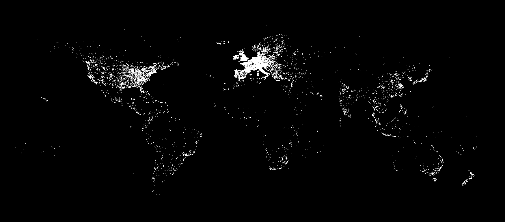
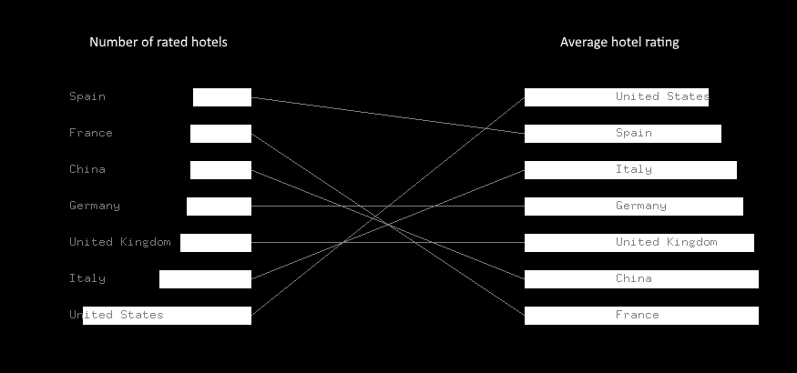

# Hotel_Mapping_Project
A IACD Project mapping all the hotels in the world.

This openframeworks project explores mapping data related to all the hotels in the world. It produces to graphics. The first is a basic map of the Lat and Long points for each of the 500,000ish points. The second is a pair of bar graphs showing the number of rated hotels and the average rating for a hotels (respectively). By comparing the two bar graphs you can learn about the quality vs. quantity of the hotels.

